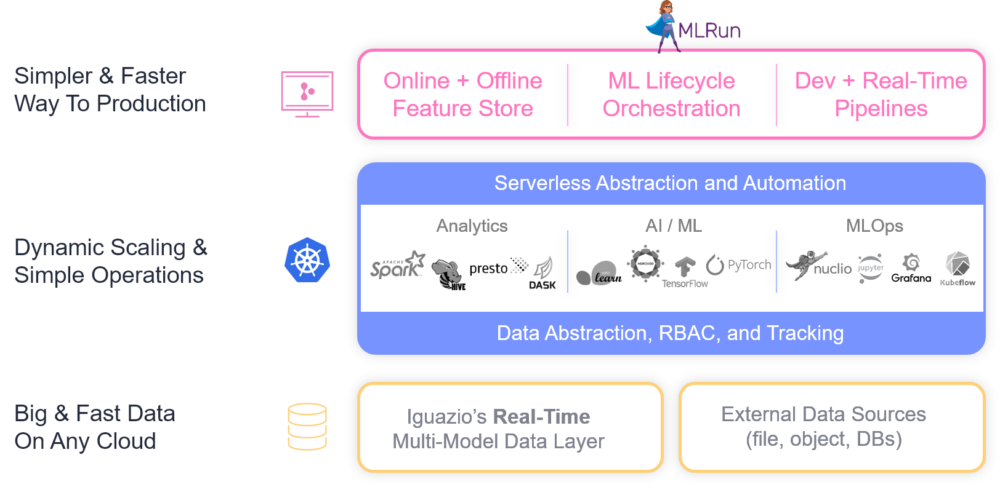
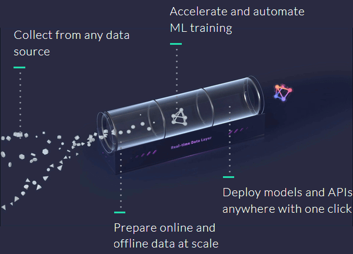

# Welcome to the Iguazio Data Science Platform

An initial introduction to the Iguazio Data Science Platform and the platform tutorials

- [Platform Overview](#platform-overview)
- [Data Science Workflow](#data-science-workflow)
- [The Tutorial Notebooks](#the-tutorial-notebooks)
- [Getting-Started Tutorial](#getting-started-tutorial)
- [End-to-End Use-Case Application and How-To Demos](#demos)
- [Installing and Updating the MLRun Python Package](#mlrun-python-pkg-install-n-update)
- [Data Ingestion and Preparation](#data-ingestion-and-preparation)
- [Additional Platform Resources](#platform-resources)
- [Miscellaneous](#misc)

<a id="platform-overview"></a>

## Platform Overview

The Iguazio Data Science Platform (**"the platform"**) is a fully integrated and secure data science platform as a service (PaaS), which simplifies development, accelerates performance, facilitates collaboration, and addresses operational challenges.
The platform incorporates the following components:

- A data science workbench that includes Jupyter Notebook, integrated analytics engines, and Python packages
- The [MLRun](https://mlrun.readthedocs.io) open-source MLOps orchestration framework for ML model management with experiments tracking and pipeline automation
- Managed data and machine-learning (ML) services over a scalable Kubernetes cluster
- A real-time serverless functions framework for model serving ([Nuclio](https://nuclio.io/))
- An extremely fast and secure data layer that supports SQL, NoSQL, time-series databases, files (simple objects), and streaming
- Integration with third-party data sources such as Amazon S3, HDFS, SQL databases, and streaming or messaging protocols
- Real-time dashboards based on Grafana

<br><br>

<a id="data-science-workflow"></a>

## Data Science Workflow

The platform provides a complete data science workflow in a single ready-to-use platform that includes all the required building blocks for creating data science applications from research to production:

- Collect, explore, and label data from various real-time or offline sources
- Run ML training and validation at scale over multiple CPUs and GPUs
- Deploy models and applications into production with serverless functions
- Log, monitor, and visualize all your data and services



<a id="the-tutorial-notebooks"></a>

## The Tutorial Notebooks

The home directory of the platform's running-user directory (**/User/&lt;running user&gt;**) contains pre-deployed tutorial Jupyter notebooks with code samples and documentation to assist you in your development &mdash; including a [**demos**](demos/README.ipynb) directory with end-to-end use-case applications (see the next section) and a [**data-ingestion-and-preparation**](data-ingestion-and-preparation/README.ipynb) directory with documentation and examples for performing data ingestion and preparation tasks.

> **Note:**
> - To view and run the tutorials from the platform, you first need to create a Jupyter Notebook service.
> - The **welcome.ipynb** notebook and main **README.md** file provide the same introduction in different formats.

<a id="getting-started-tutorial"></a>

## Getting-Started Tutorial

Start out by running the getting-started tutorial to familiarize yourself with the platform and experience firsthand some of its main capabilities.

<a href="demos/getting-started-tutorial/README.ipynb"></a>

You can also view the tutorial on [GitHub](https://github.com/mlrun/demos/blob/release/v0.8.x-latest/getting-started-tutorial/README.md).

<a id="demos"></a>

## End-to-End Use-Case Application and How-To Demos

Iguazio provides full end-to-end use-case application and how-to demos that demonstrate how to use the platform, its MLRun service, and related tools to address data science requirements for different industries and implementations.
These demos are available in the [MLRun demos repository](https://github.com/mlrun/demos).
Use the provided [**update-demos.sh**](./update-demos.sh) script to get updated demos from this repository.
By default, the script retrieves the files from the latest release that matches the version of the installed `mlrun` package (see [Installing and Updating the MLRun Python Package](#mlrun-python-pkg-install-n-update)).
The files are copied to the **/v3io/users/&lt;username&gt;/demos** directory, where `<username>` is the name of the running user (`$V3IO_USERNAME`) unless you set the `-u|--user` flag to another username.
> **Note:** Before running the script, close any open files in the **demos** directory.


```python
# Get additional demos
!/User/update-demos.sh
```

For full usage instructions, run the script with the `-h` or `--help` flag:


```python
!/User/update-demos.sh --help
```

<a id="end-to-end-use-case-applications"></a>

### End-to-End Use-Case Application Demos

<table align="left">
    <tr align="left" style="border-bottom: 1pt solid black;">
    <th>Demo</th>
    <th/>
    <th/>
    <th>Description</th>
    </tr>
    <tr>
        <td><b>scikit-learn Demo: Full AutoML pipeline</b></td>
        <td align="center", style="min-width:45px; padding: 10px;">
            <a href="demos/scikit-learn-pipeline/sklearn-project.ipynb"><br>Open locally</a>
        </td>
        <td align="center", style="min-width:45px; padding: 10px;">
            <a target="_blank" href="https://github.com/mlrun/demos/tree/release/v0.8.x-latest/scikit-learn-pipeline">
                <br>View on GitHub</a>
        </td>
        <td>Demonstrates how to build a full end-to-end automated-ML (AutoML) pipeline using <a href="https://scikit-learn.org">scikit-learn</a> and the UCI <a href="http://archive.ics.uci.edu/ml/datasets/iris">Iris data set</a>.
        </td>
    </tr>
    <tr>
        <td><b>Image-Classification Demo: Image classification with distributed training</b></td>
        <td align="center", style="min-width:45px; padding: 10px;">
            <a href="demos/image-classification-with-distributed-training/horovod-project.ipynb"><br>Open locally</a>
        </td>
        <td align="center", style="min-width:45px; padding: 10px;">
            <a target="_blank" href="https://github.com/mlrun/demos/tree/release/v0.8.x-latest/image-classification-with-distributed-training/"><br>View on GitHub</a>
        </td>
        <td>Demonstrates an end-to-end image-classification solution using <a href="https://www.tensorflow.org/">TensorFlow</a> (versions 1 or 2), <a href="https://keras.io/">Keras</a>, <a href="https://eng.uber.com/horovod/">Horovod</a>, and <a href="https://nuclio.io/">Nuclio</a>.
        </td>
    </tr>
    <tr>
        <td><b>Faces Demo: Real-time image recognition with deep learning</b></td>
        <td align="center", style="min-width:45px; padding: 10px;">
            <a href="demos/realtime-face-recognition/notebooks/face-recognition.ipynb"><br>Open locally</a>
        </td>
        <td align="center", style="min-width:45px; padding: 10px;">
            <a target="_blank" href="https://github.com/mlrun/demos/tree/release/v0.8.x-latest/realtime-face-recognition/"><br>View on GitHub</a>
        </td>
        <td>Demonstrates real-time capture, recognition, and classification of face images over a video stream, as well as location tracking of identities, using <a href="https://pytorch.org/">PyTorch</a>, <a href="https://opencv.org/">OpenCV</a>, and <a href="https://www.streamlit.io/">Streamlit</a>.
        </td>
    </tr>
    <tr>
        <td><b>Churn Demo: Real-time customer-churn prediction</b></td>
        <td align="center", style="min-width:45px; padding: 10px;">
            <a href="demos/customer-churn-prediction/churn-project.ipynb"><br>Open locally</a>
        </td>
        <td align="center", style="min-width:45px; padding: 10px;">
            <a target="_blank" href="https://github.com/mlrun/demos/tree/release/v0.8.x-latest/customer-churn-prediction/"><br>View on GitHub</a>
        </td>
        <td>Demonstrates analysis of customer-churn data using the Kaggle <a href="https://www.kaggle.com/blastchar/telco-customer-churn" rel="nofollow">Telco Customer Churn data set</a>, model training and validation using <a href="https://xgboost.readthedocs.io/" rel="nofollow">XGBoost</a>, and model serving using real-time Nuclio serverless functions.
        </td>
    </tr>
    <tr>
        <td><b>Stock-Analysis Demo</b></td>
        <td align="center", style="min-width:45px; padding: 10px;">
            <a href="demos/stock-analysis/project.ipynb"><br>Open locally</a>
        </td>
        <td align="center", style="min-width:45px; padding: 10px;">
            <a target="_blank" href="https://github.com/mlrun/demos/tree/release/v0.8.x-latest/stock-analysis/"><br>View on GitHub</a>
        </td>
        <td>Demonstrates how to tackle a common requirement of running a data-engineering pipeline as part of ML model serving by reading data from external data sources and generating insights using ML models.
            The demo reads stock data from an external source, analyzes the related market news, and visualizes the analyzed data in a Grafana dashboard.
        </td>
    </tr>
    <tr>
        <td><b>NetOps Demo: Predictive network operations / telemetry</b></td>
        <td align="center", style="min-width:45px; padding: 10px;">
            <a href="demos/network-operations/project.ipynb"><br>Open locally</a>
        </td>
        <td align="center", style="min-width:45px; padding: 10px;">
            <a target="_blank" href="https://github.com/mlrun/demos/tree/release/v0.8.x-latest/network-operations/"><br>View on GitHub</a>
        </td>
        <td>Demonstrates how to build an automated ML pipeline for predicting network outages based on network-device telemetry, also known as Network Operations (NetOps).
            The demo implements both model training and inference, including model monitoring and concept-drift detection.
        </td>
    </tr>
    <tr>
        <td><b>News Article Summarization and Keyword Extraction via NLP</b></td>
        <td align="center", style="min-width:45px; padding: 10px;">
            <a href="demos/news-article-nlp/news_article_nlp.ipynb"><br>Open locally</a>
        </td>
        <td align="center", style="min-width:45px; padding: 10px;">
            <a target="_blank" href="https://github.com/mlrun/demos/tree/release/v0.8.x-latest/news-article-nlp/"><br>View on GitHub</a>
        </td>
        <td>Demonstrates how to create an NLP pipeline that will summarize and extract keywords from a news article URL. We will be using state-of-the-art transformer models such as BERT to perform these NLP tasks.
        </td>
    </tr>
<tr>
        <td><b>Mask Detection</b></td>
        <td align="center", style="min-width:45px; padding: 10px;">
            <a href="demos/mask-detection/1-training-and-evaluation.ipynb"><br>Open locally</a>
        </td>
        <td align="center", style="min-width:45px; padding: 10px;">
            <a target="_blank" href="https://github.com/mlrun/demos/tree/release/v0.8.x-latest/mask-detection/"><br>View on GitHub</a>
        </td>
        <td>Demonstrates how to  use MLRun to create a mask detection app. We'll train a model that classifies an image of a person as wearing a mask or not, and serve it to an HTTP endpoint.
        </td>
    </tr>
</table>

<a id="howto-demos"></a>

### How-To Demos

<table align="left">
    <tr align="left" style="border-bottom: 1pt solid black;">
    <th>Demo</th>
    <th/>
    <th/>
    <th>Description</th>
    </tr>
    <tr>
        <td><b>How-To: Converting existing ML code to an MLRun project</b></td>
        <td align="center", style="min-width:45px; padding: 10px;">
            <a href="demos/howto/converting-to-mlrun/mlrun-code.ipynb"><br>Open locally</a>
        </td>
        <td align="center", style="min-width:45px; padding: 10px;">
            <a target="_blank" href="https://github.com/mlrun/demos/tree/release/v0.8.x-latest/howto/converting-to-mlrun"><br>View on GitHub</a>
        </td>
        <td>Demonstrates how to convert existing ML code to an MLRun project.
            The demo implements an MLRun project for taxi ride-fare prediction based on a <a href="https://www.kaggle.com/jsylas/python-version-of-top-ten-rank-r-22-m-2-88">Kaggle notebook</a> with an ML Python script that uses data from the <a href="https://www.kaggle.com/c/new-york-city-taxi-fare-prediction">New York City Taxi Fare Prediction competition</a>.
        </td>
    </tr>
    <tr>
        <td><b>How-To: Running a Spark job for reading a CSV file</b></td>
        <td align="center", style="min-width:45px; padding: 10px;">
            <a href="demos/howto/spark/spark-mlrun-read-csv.ipynb"><br>Open locally</a>
        </td>
        <td align="center", style="min-width:45px; padding: 10px;">
            <a target="_blank" href="https://github.com/mlrun/demos/blob/release/v0.8.x-latest/howto/spark/spark-mlrun-read-csv.ipynb"><br>View on GitHub</a>
        </td>
        <td>Demonstrates how to run a Spark job that reads a CSV file and logs the data set to an MLRun database.
        </td>
    </tr>
    <tr>
        <td><b>How-To: Running a Spark job for analyzing data</b></td>
        <td align="center", style="min-width:45px; padding: 10px;">
            <a href="demos/howto/spark/spark-mlrun-describe.ipynb"><br>Open locally</a>
        </td>
        <td align="center", style="min-width:45px; padding: 10px;">
            <a target="_blank" href="https://github.com/mlrun/demos/blob/release/v0.8.x-latest/howto/spark/spark-mlrun-describe.ipynb"><br>View on GitHub</a>
        </td>
        <td>Demonstrates how to create and run a Spark job that generates a profile report from an Apache Spark DataFrame based on pandas profiling.
        </td>
    </tr>
    <tr>
        <td><b>How-To: Running a Spark Job with Spark Operator</b></td>
        <td align="center", style="min-width:45px; padding: 10px;">
            <a href="demos/howto/spark/spark-operator.ipynb"><br>Open locally</a>
        </td>
        <td align="center", style="min-width:45px; padding: 10px;">
            <a target="_blank" href="https://github.com/mlrun/demos/blob/release/v0.8.x-latest/howto/spark/spark-operator.ipynb"><br>View on GitHub</a>
        </td>
        <td>Demonstrates how to use <a target="_blank" href="https://github.com/GoogleCloudPlatform/spark-on-k8s-operator">Spark Operator</a> to run a Spark job over Kubernetes with MLRun.
        </td>
    </tr>
</table>

<a id="mlrun-python-pkg-install-n-update"></a>

## Installing and Updating the MLRun Python Package

The demo applications and many of the platform tutorials use [MLRun](https://mlrun.readthedocs.io) &mdash; Iguazio's end-to-end open-source MLOps solution for managing and automating your entire analytics and machine-learning life cycle, from data ingestion through model development to full pipeline deployment in production.
MLRun is available in the platform via a default (pre-deployed) shared platform service (`mlrun`).
However, to use MLRun from Python code (such as in the demo and tutorial notebooks), you also need to install the [MLRun Python package](https://readthedocs.org/projects/mlrun/) (`mlrun`).
The version of the installed package must match the version of the platform's MLRun service and must be updated whenever the service's version is updated.

The platform provides an [**align_mlrun.sh**](./align_mlrun.sh) script for simplifying the MLRun package installation and version synchronization with the MLRun service.
The script is available in the running-user directory (your Jupyter home directory), which is accessible via the `/User` data mount.
Use the following command to run this script for the initial package installation (after creating a new Jupyter Notebook service) and whenever the MLRun service is updated; (the command should be run for each Jupyter Notebook service):


```python
!/User/align_mlrun.sh
```

<a id="data-ingestion-and-preparation"></a>

## Data Ingestion and Preparation

The platform allows storing data in any format.
The platform's multi-model data layer and related APIs provide enhanced support for working with NoSQL ("key-value"), time-series, and stream data.
Various steps of the data science life cycle (pipeline) might require different tools and frameworks for working with data, especially when it comes to the different mechanisms required during the research and development phase versus the operational production phase.
The platform features a wide array of methods for manipulating and managing data, of different formats, in each step of the data life cycle, using a variety of frameworks, tools, and APIs &mdash; such as as the following:

- Spark SQL and DataFrames
- Spark Streaming
- Presto SQL queries
- pandas DataFrames
- Dask
- V3IO Frames Python library
- V3IO SDK
- Web APIs

The data ingestion and preparation tutorial README (**data-ingestion-and-preparation/README.ipynb/.md**) provides an overview of various methods for collecting, storing, and manipulating data in the platform, and references to sample tutorial notebooks that demonstrate how to use these methods.
<br>
**&#x25B6; [Open the README notebook](./data-ingestion-and-preparation/README.ipynb) / [Markdown file](data-ingestion-and-preparation/README.md)**

<a id="platform-resources"></a>

## Additional Platform Resources

You can find more information and resources in the MLRun documentation:
<br>
**&#x25B6; [View the MLRun documentation](https://mlrun.readthedocs.io)**

You might also find the following resources useful:

- [Introduction video](https://www.youtube.com/watch?v=8OmAN4wd7To)
- [In-depth platform overview](platform-overview.ipynb) with a break down of the steps for developing a full data science workflow from development to production
- [Platform Services](https://www.iguazio.com/docs/v3.0/services/)
- [Platform data layer](https://www.iguazio.com/docs/v3.0/data-layer/), including [references](https://www.iguazio.com/docs/v3.0/data-layer/reference/)
- [nuclio-jupyter SDK](https://github.com/nuclio/nuclio-jupyter/blob/master/README.md) for creating and deploying Nuclio functions with Python and Jupyter Notebook

<a id="misc"></a>

## Miscellaneous

<a id="creating-virtual-environments-in-jupyter-notebook"></a>
### Creating Virtual Environments in Jupyter Notebook

A virtual environment is a named, isolated, working copy of Python that maintains its own files, directories, and paths so that you can work with specific versions of libraries or Python itself without affecting other Python projects.
Virtual environments make it easy to cleanly separate projects and avoid problems with different dependencies and version requirements across components.
See the [virtual-env](virtual-env.ipynb) tutorial notebook for step-by-step instructions for using conda to create your own Python virtual environments, which will appear as custom kernels in Jupyter Notebook.

<a id="update-notebooks"></a>
### Updating the Tutorial Notebooks

You can use the provided **igz-tutorials-get.sh** script to get updated platform tutorials from the [tutorials GitHub repository](https://github.com/v3io/tutorials/).
By default, the script retrieves the files from the latest release that matches the current platform version.
For details, see the [**update-tutorials.ipynb**](update-tutorials.ipynb) notebook.

<a id="v3io-dir"></a>
### The v3io Directory

The **v3io** directory that you see in the file browser of the Jupyter UI displays the contents of the `v3io` data mount for browsing the platform data containers.
For information about the platform's data containers and how to reference data in these containers, see [Platform Data Containers](data-ingestion-and-preparation/README.ipynb#platform-data-containers).

<a id="support"></a>
### Support

The Iguazio [support team](mailto:support@iguazio.com) will be happy to assist with any questions.
