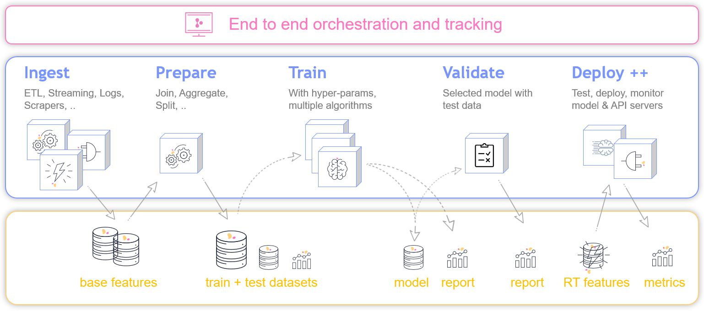

# Data ingestion and preparation overview

- [Overview](#gs-overview)
- [Basic flow](#basic)
- [Reading from external database](#databases)
- [Working with Spark](#spaek)
- [Working with streaming](#streaming)
- [Running SQL on Iguazio](#sql)
- [Managing Parquet files](#parquet)
- [Accessing Iguazio key value and time series](#frames)
- [Getting data from AWS S3](#s3)
- [Running dataframes on GPUs via Nvidia cuDF](#gpu)
- [Running distributed Python with Dask](#dask)

<a id="gs-overview"></a>
## Overview
This notebook provides an overview of the various options for collecting, storing and manipulating data in Iguazio with references to built-in <br> sample notebooks. The platform address the various requirements for manipulating data in each of the data science lifeccyle steps <br>
Thus, provides a wide set of tools for handling data using various fraemworks. <br> 

Working with data in the various stepts of the pipeline may require different tools and frameworks for each step especially when it comes to the difference <br>
mechanism needed when you are in your research phase vs an operational phase where you need to build an inferene production pipeline <br>
You may use different tools and technics within those various steps. <br>
In the notebook you'll find short sections explaining the various solutions with links to more detailed notebooks<br>


<br><br>


<a id="basic"></a>

## Basic flow

In this notebook you’ll go through basic scenarios of getting and manipulating data in Iguazio along with explaining some core concepts of working with  data on the system. <br> 
Thie notebook covers how to get a csv file from an S3 bucket, convert it into a key value table using Spark, Run a SQL query and convert it into a parquet file <br>
[**basic tutorial**](getting-started-basic.ipynb) 


<a id="databases"></a>
## Reading data from external databases

Here are several examples of how to fetch data from external databases

### Using Spark over JDBC
Spark SQL includes a data source that can read data from other databases using Java database connectivity (JDBC).<br>
The results are returned as a Spark DataFrame that can easily be processed in Spark SQL or joined with other data sources. <br>
In this notebooks we have several examples of getting data from various databases such as MySQL , Oracle, Postgress and others <br>
[**Spark over JDBC**](spark-jdbc.ipynb)

### Using SQL Alchemy 
In this notebook users can learn how to work with SQLAlchemy which is the Python SQL toolkit and Object Relational Mapper <br>
that gives application developers the full power and flexibility of SQL and then read the data into dataframes and work with Python data frame on the dataset <br>
[**Using SQLAlchemy**](read-external-db.ipynb)

<a id="spark"></a>

## Working with Spark

Spark is a built-in service in Iguazio and it uses for both analyzing and manipulating a large set of data in a distributed way as well as for analyzing streams using its Spark streaming module <br>
Spark lets you query structured data inside Spark programs by using either SQL or a familiar DataFrame API.<br>
DataFrames and SQL provide a common way to access a variety of data sources. <br>
In this notebook, you'll learn how to use Spark SQL and DataFrames to access objects, tables, and unstructured data that persist in the data containers of the Iguazio data platform. <br>
The platform's Spark drivers implement the data-source API and support predicate push down: <br>
the queries are passed to the platform's data store, which returns only the relevant data. <br>
This allow accelerated and high-speed access from Spark to data stored in the platform.<br>
[**Working with Spark**](spark-sql-analytics.ipynb)

### Ingesting data using Spark
Spark can be useful for ingesting data into the system for both batch or micro batch processing <br>
https://www.iguazio.com/docs/tutorials/latest-release/getting-started/data-ingestion-w-spark-qs/


<a id="streaming"></a>

## Working with Streaming

### Using Nuclio to get data from common streaming engines
Iguazio has a serverless function (AKA Nuclio) that provides a mechanism to analyze and process real time events from various streaming engines. <br> 
The following streaming frameworks are being supported:<br>
Kafaka, kinesis, Azure event hub, Iguazio stream, RabbitMQ, MQTT <br>
Using Nuclio functions for getting and analyzing streaming data in real time is a very common practice when building a real time pipeline. <br>
Streaming could be: images/videos,  telemetry data , financial transactions, web clicks , sensors data etc.. <br> 
Along with reading the stream events, customers can implement their own logic within the nuclio function to manipulate or enrich the data and prepare it for the next step in the pipeline.<br>
The Nuclio serverless function can sustain high load of workloads with very low latencies ,thus it makes it very useful for building an event driven applications with strict latency requirements.<br>
Here you can find additional information:<br>
https://www.iguazio.com/docs/intro/latest-release/serverless/

### Iguazio built-in streaming (V3IO) 
Iguazio has its own built-in streaming engine called V3IO stream. This stream is often being used in real time pipeline for writing into a queue. <br> 
it can also serve as a streaming engine in a similar way to kafka or kinesis so users don't need to use an external one. <br>
In this notebook you’ll find an example of writing a nuclio function that uses Iguazio stream: <br>
[**Reading from V3IO stream**](../demos/real-time-user-segmentation.ipynb)

### Spark streaming
Need an example


<a id="sql"></a>

## Runnig SQL queries on Iguazio data layer

Users can run SQL queries to fetch data that resides on Iguazio key value and Parquet files. There are two options to run SQL query: <br>

### Running full ANSII SQL queries
Iguazio has a built-in service called Presto. Presto is an open source that provides distributed framework for running SQL queries. <br>
To run a query using Presto from your notebook all you need to do is to use %SQL magic command and then write the query.  <br>
Those queries will be running as distributed queries across Iguazio application nodes <br>
In this basic tutorial you can find an example for running such query using the %SQL magic command <br>
[**basic tutorial**](getting-started-basic.ipynb) <br>

Note that for running queries on Parquet table you need to work with Hive tables. In this notebook you can find an example <br> 
of a script that takes a csv file and convert it to a hive table. <br>
[**Working with Hive tables**](csv-to-hive.ipynb) <br>

### Using Spark SQL
Spark is a built-in service in running in the platfrom and users can run SQL queries using Spark SQL <br>
[**Running SQL with Spark**](spark-sql-analytics.ipynb)


### Running SQL from a Nuclio function 
In some cases users need to run a SQL query as part an event driven application. In this notebook you'll see an example of <br>
running a SQL query as part of a nuclio function <br>
[**Running SQL from Nuclio function**](nuclio-read-via-presto.ipynb)


<a id="parquet"></a>

## Managing Parquet files

Parquet  is a columnar storage format that provides high-density high-performance file organization. The following section demonstrates how to create and write data to a Parquet table in the Iguazio Data Science Platform and read its contents. For information about <br> reading and writing Parquet files from Python applications view the notebook below: <br>
[**Managing Parquet files**](parquet-read-write.ipynb) <br>

Once you bring Parquet files into the platform you may want to create hive tables and run SQL queries on those tables <br>
This notebook covers the way to do it: <br>
[**Convert Parquet to hive**](parquet-to-hive.ipynb)


<a id="frames"></a>

## Accessing Iguazio's key value and Time series data using a native library (Frames)

Iguazio has a multi model data layer that store data as key value and time series format. Users can access the data using various tools and APIs such as Spark, SQL or pandas dataframe and it can also access the data using a build-in framework called Frames. 
Frames is a multi-model open-source data-access library, developed by Iguazio, which provides a unified high-performance DataFrame API for working with data in the data store of the Iguazio Data Science Platform. Frames currently supports the NoSQL (key/value) and time-series (TSDB) data models via its kv and tsdb backends.
This notebook explain how to work with Frames: <br>
[**Working with Frames**](frames.ipynb)


<a id="s3"></a>

## Getting data from AWS S3

The simple way for getting data from S3 is just by using a curl command sending a request to the AWS S3 bucket


```sh
%%sh
CSV_PATH="/User/examples/stocks.csv"
curl -L "iguazio-sample-data.s3.amazonaws.com/2018-03-26_BINS_XETR08.csv" > ${CSV_PATH}
```

Future – need to add a reference to the XCP tool and how to load bulk of data from S3

<a id="dask"></a>

## Running distributed python code with Dask

The dask frameworks enabling users to parallelize internal systems as not all computations fit into a dataframe. Dask exposes lower-level APIs letting you build custom systems for in-house applications. This helps parallelize python processes and dramatically accelerate their performance <br>
[**Configuring a dask cluster**](dask-cluster.ipynb)


<a id="gpu"></a>

## Running dataframes on GPUs via Nvidia cuDF

Iguazio has deployed the Nvidia Rapids library as part of its solution enabling users to easily access GPU resources. <br>
cuDF is a GPU DataFrame library for loading, joining, aggregating, filtering, and otherwise manipulating data. <br>
cuDF provides a pandas-like API that will be familiar to data engineers & data scientists, so they can use it to easily accelerate their workflows without going into the details of CUDA programming. <br>
This notebook provide a sample example of using cuDF  <br>
[**cudf vs pandas dataframe**](gpu-cudf-vs-pd.ipynb)


```python

```
