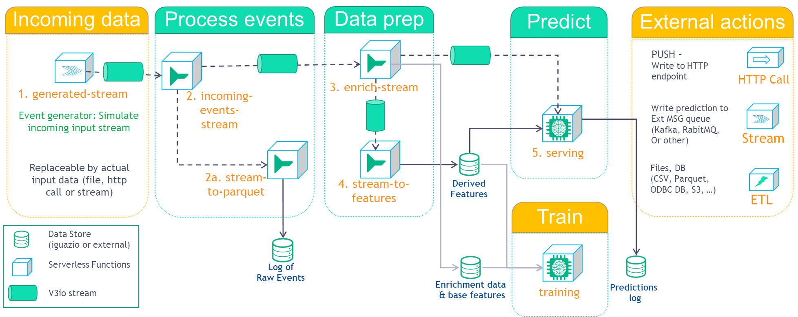

# Model Deployment with Streaming

This demo shows how to deploy a model with streaming information. The demo covers the use case of 1st-day churn. However, it is easy to replace the data, related features and training model and reuse the same workflow for different business cases.

It is comprised of several steps:

These steps are covered by the following notebooks:

- [**0. Setup**](0-setup.ipynb) - Creates the project and the relevant streams.
- [**1. Event generator**](1-event-generator.ipynb) — Generates events for the training and serving. 
- [**2. incoming event handler**](2-incoming-event-handler.ipynb) - Receive data from the input. This is a common input stream for all the data. This way, one can easily replace the event source data (in this case we have a data generator) without affecting the rest of this flow.
- [**2a. Stream to parquet**](2a-stream-to-parquet.ipynb) - Store all incoming data to parquet files.
- [**3a. Enrichment table**](3a-enrichment-table.ipynb) - Create an enrichment table (lookup values).
- [**3b. Enrich stream**](3b-enrich-stream.ipynb) - Enrich the stream using the enrichment table.
- [**4. Stream to features**](4-stream-to-features.ipynb) - Update aggregation features using the incoming event handler.
- [**5. Serving**](5-serving.ipynb) - Serve the model and process the data from the enriched stream and aggregation features.

This demo comes with a pre-trained model using the base features, enrichment data and derived features, calculated using the same generated data. You can retrain the model or train a new model by opening and running the  [**4b. optional training notebook**](4b-optional-training.ipynb). You will need to ensure enough data is collected via the streams to the data storage in order to train a new model.

## About this demo

### Input Data

The event generator ([1-event-generator.ipynb](1-event-generator.ipynb)) creates the following events: `new_registration`, `new_purchases`, `new_bet` and `new_win` with the following data:

| new_registration |   | new_purchases |   | new_bet    |   | new_win    |
|------------------|---|---------------|---|------------|---|------------|
| user_id          |   | user_id       |   | user_id    |   | user_id    |
| event_type       |   | event_type    |   | event_type |   | event_type |
| event_time       |   | event_time    |   | event_time |   | event_time |
| name             |   | amount        |   | bet_amount |   | win_amount |
| date_of_birth    |   |               |   |            |   |            |
| street_address   |   |               |   |            |   |            |
| city             |   |               |   |            |   |            |
| country          |   |               |   |            |   |            |
| postcode         |   |               |   |            |   |            |
| affiliate_url    |   |               |   |            |   |            |
| campaign         |   |               |   |            |   |            |

Furthermore, `new_registration` includes a `label` column to indicate whether or not the user has churned (1 for churned and 0 for not)

## Enrichment

The enrichment table ([3a-enrichment-table.ipynb](3a-enrichment-table.ipynb)) contains a lookup of postcode and returns a socioeconomic index (`socioeconomic_idx`). The enriched stream contains the original data and the enriched data.

## Feature calculation

During the feature calculation ([4-stream-to-features.ipynb](4-stream-to-features.ipynb)), we calculate sum, mean, count and variance for the 3 amount fields (`amount`, `bet_amount` and `win_amount` for `new_purchases`, `new_bet` and `new_win` respectively). This results with the following list of fields:

- purchase_sum
- purchase_mean
- purchase_count
- purchase_var
- bet_sum
- bet_mean
- bet_count
- bet_var
- win_sum
- win_mean
- win_count
- win_var

